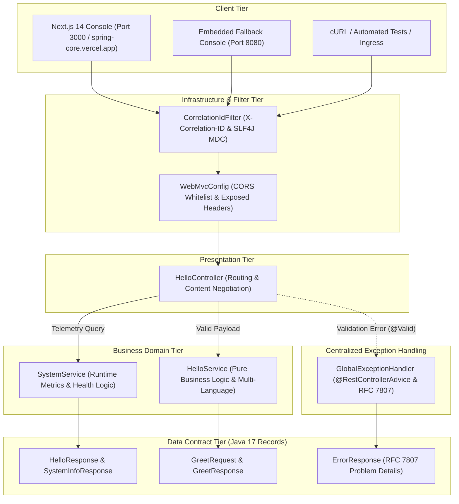
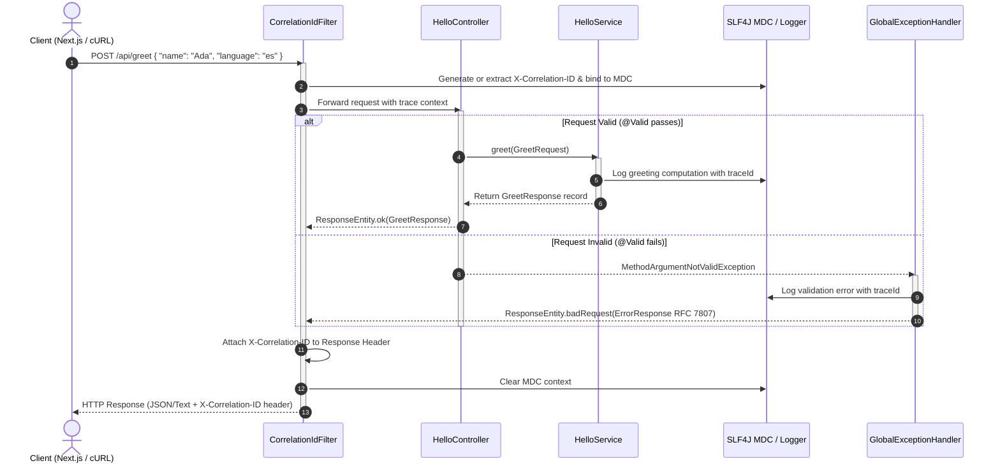

# SpringCore - Technical Architecture & Design Blueprint

This document provides an exhaustive, in-depth explanation of the technical architecture, design patterns, separation of concerns, and cross-cutting infrastructure implemented in **SpringCore**.

**Author:** [Aaditya Gunjal](https://github.com/aaditya09750)

### Live Production Deployments
- **Frontend Console (Vercel):** [https://spring-core.vercel.app](https://spring-core.vercel.app)
- **Backend REST API (Render):** [https://springcore-api.onrender.com](https://springcore-api.onrender.com)

---

## 1. High-Level Architectural Vision

SpringCore is engineered as a **Clean Layered Architecture** with strict boundary separation between HTTP transport, business logic, data contracts, and cross-cutting observability:



---

## 2. Request Lifecycle & End-to-End Sequence

The following sequence diagram outlines how an incoming request flows through each layer:



---

## 3. Layered Package Architecture

### 3.1 Presentation Layer (`com.example.springcore.controller`)

Controllers in SpringCore strictly serve as entry points for HTTP requests. They do not contain any business calculations, validation rules, or database logic.

- **`HelloController.java`**:
  - Exposes `/hello` and `/api/hello-world` with explicit content negotiation (`produces = MediaType.TEXT_PLAIN_VALUE`).
  - Exposes `/api/hello` returning structured `HelloResponse` DTO.
  - Exposes `/api/greet` supporting custom greetings with multi-lingual options and Jakarta validation.
  - Exposes `/api/info` providing runtime environment metrics, active profiles, and JVM information.

### 3.2 Business Service Layer (`com.example.springcore.service`)

The service layer contains pure business logic and remains completely decoupled from `HttpServletRequest`, `HttpServletResponse`, or HTTP status codes.

- **`HelloService.java`**:
  - Encapsulates multi-language greeting translation rules (`en`, `es`, `fr`, `de`, `hi`, `ja`).
  - Formats human-readable timestamps and correlation identifiers.
  - Enables sub-millisecond execution and straightforward unit testing via Mockito without launching an embedded Web server.

### 3.3 Data Contract Layer (`com.example.springcore.dto`)

All contracts in SpringCore are modeled using **Java 17 Records**:

- **Immutability by Default:** No mutable setters; state cannot be modified once instantiated.
- **Concise Syntax:** Automatically provides canonical constructors, accessors, `equals()`, `hashCode()`, and `toString()`.
- **Validation Annotations:** Applied directly to record components:
  ```java
  public record GreetRequest(
      @NotBlank(message = "Name must not be empty or blank")
      @Size(min = 1, max = 50, message = "Name must be between 1 and 50 characters")
      String name,

      @Pattern(regexp = "^(en|es|fr|de|hi|ja)?$", message = "Language must be one of: en, es, fr, de, hi, ja")
      String language
  ) {}
  ```

### 3.4 Cross-Cutting & Infrastructure Layer

#### A. Distributed Tracing (`CorrelationIdFilter.java`)
- Inspects incoming requests for an existing `X-Correlation-ID` header (propagated from upstream API gateways or microservices).
- If absent, generates an 8-to-32-character high-entropy UUID token.
- Sets the ID in SLF4J MDC (`MDC.put("correlationId", id)`), ensuring all log statements generated during the thread's execution automatically include the trace ID.
- Injects the header into the `HttpServletResponse` so the client can reference the exact server-side log trace.
- Guarantees MDC cleanup in a `finally` block to prevent thread-pool memory leaks.

#### B. Centralized RFC 7807 Exception Handling (`GlobalExceptionHandler.java`)
- Uses `@RestControllerAdvice` to intercept exceptions across all controllers.
- Translates `MethodArgumentNotValidException` (thrown when `@Valid` fails) into a structured `ErrorResponse` containing field-level validation errors.
- Catches `IllegalArgumentException` and maps it to HTTP 400 Bad Request.
- Catches uncaught `Exception` instances and maps them to HTTP 500 Internal Server Error, masking internal stack traces from clients while logging them with the active correlation ID.

#### C. Cross-Origin Resource Sharing (`WebMvcConfig.java`)
- Whitelists frontend clients (`http://localhost:3000`, `http://127.0.0.1:3000`).
- Permits HTTP verbs: `GET`, `POST`, `PUT`, `DELETE`, `PATCH`, `OPTIONS`.
- Exposes critical headers to browsers, notably `X-Correlation-ID` and `Content-Disposition`.

---

## 4. Frontend Architecture (Decoupled Dashboard)

The frontend application located in `frontend/` is built on Next.js 14, TypeScript, and Tailwind CSS.

### Key Architectural Pillars:
1. **Zero-Configuration Reverse Proxy & Trailing-Slash Sanitization:**
   Next.js `next.config.mjs` configures rewrites to proxy `/api/:path*`, `/actuator/:path*`, and `/hello` directly to `${BACKEND_URL}` (with automatic trailing slash stripping via `rawBackendUrl.trim().replace(/\/+$/, '')`), eliminating browser CORS issues in both local development and cloud production.
2. **Resilient Response Parser:**
   The `api-client.ts` client reads responses as raw text before attempting JSON parsing. This prevents parse exceptions when calling text endpoints like `/hello`.
3. **Cloud Production Deployment Architecture:**
   - **Frontend:** Hosted on **Vercel** at [https://spring-core.vercel.app](https://spring-core.vercel.app)
   - **Backend:** Hosted on **Render** at [https://springcore-api.onrender.com](https://springcore-api.onrender.com) via multi-stage Docker container
   - **Edge Routing:** Requests to `spring-core.vercel.app/hello` or `/api/*` transparently proxy to the Render backend origin server-to-server.
4. **Design System & Aesthetics:**
   - Strict 5-color dark palette with high-contrast semantics.
   - Glassmorphic header with `backdrop-filter: blur(16px)` and sticky scroll pinning.
   - Flat, subtle elevation with zero harsh drop shadows on interactive elements.
   - 14px restrained border radii for cards and 50% circular badges for status indicators.

---

## 5. Observability & Health Monitoring

SpringCore integrates **Spring Boot Actuator** with production-grade endpoints:

| Endpoint | Purpose | Upstream Target |
| :--- | :--- | :--- |
| `/actuator/health` | Comprehensive application health | Kubernetes, Cloud Load Balancers |
| `/actuator/health/liveness` | Pod liveness probe | Kubernetes Kubelet |
| `/actuator/health/readiness` | Traffic readiness probe | Kubernetes Service Ingress |
| `/actuator/info` | Application metadata | CI/CD Deploy Monitors |

---

## 6. Security Considerations & Hardening

1. **Input Sanitization:** All user payloads are validated at the perimeter via Jakarta Bean Validation.
2. **Stack Trace Concealment:** Stack traces are never leaked in HTTP response bodies. Clients receive only the correlation ID to share with operations.
3. **CORS Hardening:** Production deployments can dynamically bind allowed origins via `application.yml` environment variables.
4. **Header Injection Protection:** Custom headers are validated and scrubbed of newline characters to prevent HTTP response splitting.

---

## 7. Future Architectural Extensions

The SpringCore clean foundation is ready for seamless expansion into:
- **Persistence:** Add Spring Data JPA / Hibernate and PostgreSQL/MySQL entities without refactoring the controller or DTO layers.
- **Security:** Integrate Spring Security 6 with JWT stateless bearer tokens in the filter pipeline.
- **Caching & Rate Limiting:** Introduce Redis-backed distributed caching and Bucket4j rate limiting.
- **Event-Driven Messaging:** Integrate Spring Cloud Stream or Apache Kafka for asynchronous event publication.

