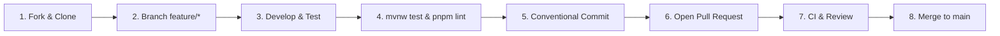

# Contributing to SpringCore

Thank you for your interest in contributing to **SpringCore**! We welcome contributions from developers of all skill levels—whether you are fixing a typo, improving documentation, submitting bug reports, or implementing enterprise architectural patterns.

**Author:** [Aaditya Gunjal](https://github.com/aaditya09750)

Please take a moment to review this guideline to ensure a smooth, efficient, and collaborative experience.

---

## Code of Conduct

By participating in this project, you agree to abide by our [Code of Conduct](CODE_OF_CONDUCT.md). Please treat all contributors and maintainers with respect, empathy, and professional courtesy.

---

## Getting Started

### Prerequisites

Ensure you have the following installed on your development workstation:

| Requirement | Minimum Version | Recommended | Check Command |
| :--- | :--- | :--- | :--- |
| **Java JDK** | 17 LTS | OpenJDK 17 or 21 | `java -version` |
| **Apache Maven** | 3.9+ | Included Maven Wrapper (`mvnw`) | `./mvnw -version` |
| **Node.js** | 18 LTS | 20+ LTS | `node -v` |
| **pnpm** | 9.x | Latest 9.x | `pnpm -v` |
| **Git** | 2.x | Latest | `git --version` |

> **Note:** For the frontend, **always use `pnpm`**. Do not commit `package-lock.json` or `yarn.lock` to the repository.

---

## Development Workflow



### 1. Fork & Clone the Repository

```bash
# Clone your fork
git clone https://github.com/<your-username>/springcore.git
cd springcore

# Configure upstream remote
git remote add upstream https://github.com/aaditya09750/springcore.git
git fetch upstream
```

### 2. Branching Strategy

Always create a descriptive branch off of the `main` branch:

- `feature/<feature-name>`: For new features or architectural capabilities
- `fix/<issue-description>`: For bug fixes and patch corrections
- `docs/<topic>`: For documentation updates, guides, and diagrams
- `refactor/<module>`: For non-breaking code cleanups and structure optimizations
- `test/<suite>`: For test additions and coverage improvements

```bash
# Create and switch to your feature branch
git checkout -b feature/jwt-authentication
```

---

## Building and Testing

### Backend (Spring Boot 4)

Use the included Maven Wrapper (`./mvnw` on Linux/macOS or `.\mvnw.cmd` on Windows):

```bash
# Clean compile and package
./mvnw clean compile

# Run all unit and integration tests (9/9 must pass)
./mvnw test

# Run backend application locally on http://localhost:8080
./mvnw spring-boot:run
```

Verify backend health endpoints:
```bash
curl http://localhost:8080/actuator/health
curl http://localhost:8080/hello
curl http://localhost:8080/api/info
```

### Frontend (Next.js 14)

Navigate to the `frontend/` directory:

```bash
cd frontend

# Install dependencies via pnpm
pnpm install

# Run the local Next.js development server on http://localhost:3000
pnpm dev

# Run TypeScript type check and ESLint
pnpm lint

# Run production build validation
pnpm build
```

---

## Coding Standards & Architectural Guidelines

To maintain clean code and enterprise-grade reliability, all contributions must adhere to the following principles:

### 1. Strict Layered Architecture
- **Presentation (`com.example.springcore.controller`):** Exclusively handles HTTP routing, request parsing, and status code negotiation. No business logic in controllers.
- **Business Logic (`com.example.springcore.service`):** Contains domain logic, orchestrations, and data calculations. Services must be unit-testable in isolation.
- **Data Transfer Objects (`com.example.springcore.dto`):** Must be modeled as **immutable Java 17 records**. Avoid mutable JavaBean setters.
- **Exception Handling (`com.example.springcore.exception`):** Throw domain exceptions and handle them centrally in `GlobalExceptionHandler` using RFC 7807 problem details.
- **Filter Layer (`com.example.springcore.config`):** Intercepts requests for cross-cutting observability (`CorrelationIdFilter`).

### 2. Validation
- Always enforce input boundary validation using Jakarta Bean Validation annotations (`@NotNull`, `@NotBlank`, `@Size`, `@Pattern`) on request records.
- Use `@Valid` on controller parameters to trigger automated validation.

### 3. Distributed Tracing & Logging
- Use SLF4J (`LoggerFactory.getLogger`) for all logging. Avoid `System.out.println`.
- Never mutate or strip the `X-Correlation-ID` header.
- Ensure sensitive data (passwords, tokens, PII) is redacted from logs.

### 4. UI / Frontend Guidelines
- All cards, navbars, and inputs must use **borderless design** (`border-0` or borderless focus rings).
- Card corner radii must remain restrained (`14px` / `rounded-[14px]`).
- Icon backgrounds and status dots should be fully circular (`rounded-full`).
- All buttons must use flat, subtle shadows or zero shadows—**no harsh dark box shadows**.
- Response parsers must handle both raw plain text and JSON without throwing errors.

---

## Commit Message Convention

We enforce the **Conventional Commits** specification:

```text
<type>(<scope>): <short summary>

[optional body explaining context, motivation, and tradeoffs]

[optional footer(s), e.g. Closes #123]
```

### Supported Types:
- `feat`: A new feature or endpoint
- `fix`: A bug fix
- `docs`: Documentation only changes
- `style`: Formatting, missing semicolons, etc. (no code logic change)
- `refactor`: Refactoring production code without changing behavior
- `perf`: Performance optimization
- `test`: Adding missing tests or correcting existing tests
- `chore`: Build process, tooling, or dependency updates

### Examples:
```text
feat(controller): add rate limiting support to greet endpoint
fix(parser): prevent json parse error on plain text hello response
docs(readme): add troubleshooting section for port 8080 collisions
```

---

## Pull Request Process

1. **Keep PRs Focused:** Submit a pull request for a single logical change or feature. Avoid large, unfocused PRs.
2. **Update Tests:** If you add a new endpoint or service method, include comprehensive unit and integration tests.
3. **Run Full Verification:**
   ```bash
   ./mvnw clean test
   cd frontend && pnpm lint && pnpm build
   ```
4. **Update Documentation:** If your change modifies endpoints, configurations, or properties, update `README.md` and `ARCHITECTURE.md`.
5. **Submit PR:** Open a Pull Request against the `main` branch with a clear description of:
   - What changed
   - Why the change is necessary
   - How the change was tested (commands, screenshots, or curls)

---

## Reporting Issues & Security Bugs

- **General Bugs & Suggestions:** Please open an issue on the [GitHub Issues](https://github.com/aaditya09750/springcore/issues) tab using the appropriate issue template.
- **Security Vulnerabilities:** Please do **not** report security vulnerabilities via public GitHub issues. Refer to [SECURITY.md](SECURITY.md) for our private vulnerability disclosure process.

Thank you for helping make **SpringCore** the best reference architecture for developers learning modern enterprise Spring Boot!

