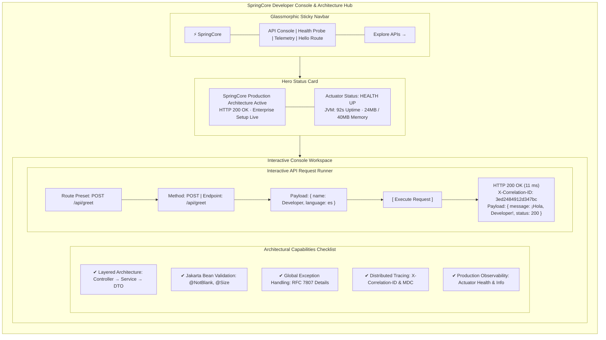
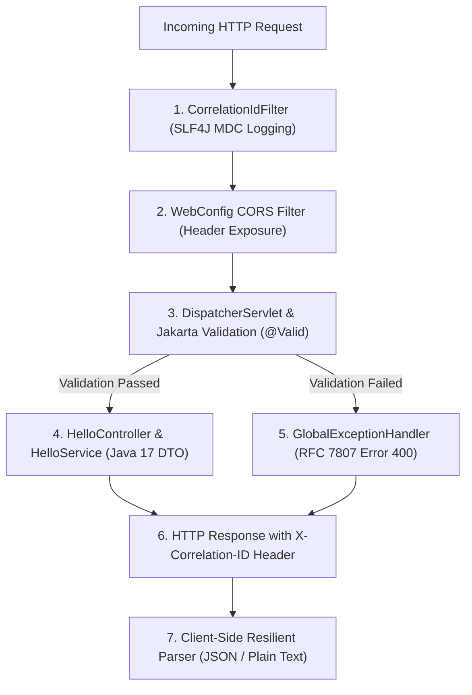

# SpringCore - Spring Boot 4 Starter & Full-Stack Blueprint

> Production ready Spring Boot 4 reference architecture & decoupled Next.js developer console.


[-brightgreen?style=for-the-badge&logo=githubactions&logoColor=white)](https://github.com/aaditya09750/springcore)
[](LICENSE)

SpringCore is a production-grade Spring Boot 4 foundational starter engineered for students, software engineers, and developers building scalable, enterprise-ready Java microservices. The project features a strict layered architecture, immutable Java 17 records, Jakarta Bean Validation, RFC 7807 problem details error handling, distributed tracing with `X-Correlation-ID`, and an integrated, borderless Next.js developer console.

**Author:** [Aaditya Gunjal](https://github.com/aaditya09750)

---

## Architectural Philosophy & Disclaimer

This project is engineered strictly for **educational, architectural reference, and production starter purposes**. It demonstrates the internal mechanics of clean architecture, separation of concerns, enterprise exception handling, distributed tracing filters, and full-stack API testing ergonomics. Use it as a solid launchpad for building scalable microservices, university capstone projects, portfolio showcases, or production REST APIs.

---

## Visual Demonstration

### Interactive API Console & Architecture Checklist



The visual demonstration illustrates the dual-surface experience: an embedded zero-configuration UI served directly on port `8080` and a high-performance decoupled Next.js developer dashboard on port `3000`.

---

## Core Features

- **Strict Layered Clean Architecture:** Complete decoupling between Presentation (`controller`), Business Logic (`service`), Data Contracts (`dto`), and Infrastructure (`config`, `exception`).
- **Immutable Java 17 Records:** High-performance, immutable Data Transfer Objects (DTOs) with zero boilerplate and full compile-time safety.
- **Jakarta Bean Validation:** Comprehensive payload validation rules (`@NotBlank`, `@Size`, `@Pattern`) enforced at the HTTP boundary before business logic execution.
- **RFC 7807 Problem Details:** Centralized `@RestControllerAdvice` transforming domain errors, validation failures, and unhandled exceptions into RFC 7807 compliant error payloads.
- **Distributed Tracing Filter:** Automatic `X-Correlation-ID` extraction, generation, SLF4J MDC injection, and response header reflection for observability across distributed systems.
- **Production Actuator Probes:** Ready-to-go Kubernetes liveness (`/actuator/health/liveness`) and readiness (`/actuator/health/readiness`) health check probes.
- **Cross-Origin Resource Sharing (CORS):** Centralized CORS configuration with preflight handling, exposed headers, and origin whitelisting.
- **Decoupled Next.js Developer Dashboard:** Interactive testing console built with Next.js 14, TypeScript, and Tailwind CSS, utilizing `pnpm`.
- **Custom Sleek Scrollbar:** Cross-browser slim scrollbars matching the 5-color palette across JSON payload editors, response inspectors, and page windows.
- **Sticky Glassmorphic Navbar:** Pinned floating header with smooth frosted-glass blur (`backdrop-filter: blur(16px)`) that stays visible during long API inspections.
- **Modern Borderless Aesthetics:** Designed around restrained radii (14px cards, 12px nav, 9px buttons, 50% circular badges) and zero harsh dark drop shadows.

---

## Advanced Capabilities (v2.0 Architecture)

### 1. Resilient Content Negotiation & Non-Breaking Parser

The API client safely buffers raw response text before attempting JSON deserialization, preventing client-side crashes when switching between plain text (`/hello`) and structured JSON (`/api/greet`, `/api/info`):

```javascript
const rawText = await response.text();
let dataText = rawText;
try {
  const json = JSON.parse(rawText);
  dataText = JSON.stringify(json, null, 2); // Pretty-print if valid JSON
} catch (_) {
  dataText = rawText; // Display plain text cleanly without error
}
```

### 2. Distributed Correlation ID Tracing

Every incoming HTTP request is assigned or preserves an existing `X-Correlation-ID` header. The `CorrelationIdFilter` binds this ID to SLF4J MDC, enabling seamless log correlation:

```text
2026-09-20 02:45:19.121 [http-nio-8080-exec-1] INFO  HelloController [traceId=a60e7393921344c4] - Greeting request received
```

### 3. Professional Custom Dropdown

Replaces native browser `<select>` boxes with an accessible, keyboard-navigable (`Escape`), and outside-click responsive dropdown component with color-coded HTTP method badges.

---

## Technology Stack

| Technology | Version | Purpose |
| ---------- | ------- | ------- |
| Java | 17+ (LTS) | Core enterprise backend runtime and language |
| Spring Boot | 4.1.1 | Enterprise application framework and microservice foundation |
| Spring Web MVC | 4.1.1 | RESTful presentation layer and request dispatching |
| Spring Boot Actuator | 4.1.1 | Production health probes, metrics, and application info |
| Jakarta Validation | 3.0+ | Declarative boundary validation (`@Valid`, `@NotBlank`) |
| SLF4J / Logback | Latest | Structured logging with MDC distributed trace injection |
| Next.js | 14.2.15 | Decoupled developer console and frontend dashboard |
| React | 18.3.1 | Declarative UI component hierarchy |
| TypeScript | 5.6.3 | Compile-time type safety across frontend and API contracts |
| Tailwind CSS | 3.4.14 | Utility-first styling with curated 5-color design system |
| Lucide React | 0.453.0 | Modern SVG icon set |
| pnpm | 9.x | Fast, disk-efficient package manager |
| JUnit 5 / Mockito | Latest | Automated unit and integration testing suite |

---

## Project Structure

```text
SpringCore/
|
+-- src/                                      [Spring Boot Backend Source Directory]
|   +-- main/
|   |   +-- java/com/example/springcore/
|   |   |   +-- SpringCoreApplication.java    Bootstrap entry point (@SpringBootApplication)
|   |   |   +-- common/
|   |   |   |   +-- AppConstants.java         Application-wide constants & header keys
|   |   |   +-- config/
|   |   |   |   +-- CorrelationIdFilter.java  MDC tracing filter for X-Correlation-ID
|   |   |   |   +-- WebConfig.java            CORS mappings & exposed header configuration
|   |   |   +-- controller/
|   |   |   |   +-- HelloController.java      REST endpoints (/hello, /api/greet, /api/info)
|   |   |   +-- dto/
|   |   |   |   +-- GreetingRequest.java      Java 17 record with @NotBlank, @Size
|   |   |   |   +-- HelloResponse.java        Immutable greeting response record
|   |   |   |   +-- SystemInfoResponse.java   JVM telemetry & uptime contract
|   |   |   |   +-- ErrorResponse.java        RFC 7807 problem details specification
|   |   |   +-- exception/
|   |   |   |   +-- GlobalExceptionHandler.java Centralized @RestControllerAdvice
|   |   |   |   +-- ResourceNotFoundException.java Custom domain exception
|   |   |   +-- service/
|   |   |       +-- HelloService.java         Greeting business logic contract
|   |   |       +-- SystemService.java        JVM telemetry contract
|   |   |       +-- impl/                     Concrete service implementations
|   |   +-- resources/
|   |       +-- application.yml               Actuator exposure & logging pattern config
|   |       +-- static/
|   |           +-- index.html                Embedded static testing UI (port 8080)
|   +-- test/
|       +-- java/com/example/springcore/
|           +-- SpringCoreApplicationTests.java Context load & end-to-end integration tests
|           +-- HelloControllerTest.java      Dedicated controller & validation tests
|
+-- frontend/                                 [Next.js Frontend Source Directory]
|   +-- src/
|   |   +-- app/                              App router, typography, & layout
|   |   +-- components/
|   |   |   +-- ui/                           Button, Badge, Card, Toast components
|   |   |   +-- layout/                       Sticky Navbar, Container
|   |   |   +-- features/                     ApiConsole, PresetChips, TelemetryBadge
|   |   +-- hooks/                            useApiRequest & useTelemetry hooks
|   |   +-- lib/                              Typed API client & utilities
|   |   +-- types/                            TypeScript interfaces mirroring Java records
|   +-- package.json                          Frontend dependency manifest
|   +-- next.config.mjs                       Reverse proxy rewrites to Spring Boot (:8080)
|   +-- tailwind.config.ts                    Design tokens & 5-color palette definition
|
+-- pom.xml                                   Maven build descriptor (Spring Boot 4.1.1)
+-- mvnw / mvnw.cmd                           Cross-platform Maven Wrapper binaries
+-- README.md                                 Comprehensive documentation (this file)
+-- ARCHITECTURE.md                           Detailed architectural design document
+-- CONTRIBUTING.md                           Developer contribution workflow
+-- CHANGELOG.md                              Release notes and version history
+-- LICENSE                                   MIT License
```

---

## Quick Start

### Prerequisites

| Requirement | Minimum Version | Download Link |
| ----------- | --------------- | ------------- |
| Java JDK | 17 or higher | [adoptium.net](https://adoptium.net/) |
| Node.js | 18 or higher | [nodejs.org](https://nodejs.org/) |
| pnpm | 9.x or higher | [pnpm.io](https://pnpm.io/installation) |
| Git | 2.x | [git-scm.com](https://git-scm.com/) |

---

### Step 1 — Clone the Repository

```bash
git clone https://github.com/<your-username>/SpringCore.git
cd SpringCore
```

---

### Step 2 — Start the Spring Boot Backend

Run the backend service on port `8080`:

**Windows (PowerShell):**
```powershell
.\mvnw.cmd spring-boot:run
```

**macOS / Linux:**
```bash
./mvnw spring-boot:run
```

Once started, the backend is active at `http://localhost:8080`.

---

### Step 3 — Start the Next.js Frontend

Open a second terminal window, navigate to the `frontend/` directory, and start the development server using **`pnpm`**:

```bash
cd frontend
pnpm install
pnpm dev
```

The Next.js dashboard is live at `http://localhost:3000`.

---

### Step 4 — Verify the Setup

1. Open your browser and navigate to **`http://localhost:8080`** for the embedded Spring Boot console.
2. Open **`http://localhost:3000`** for the full-featured Next.js testing environment.
3. Click **TEST GET /HELLO** to verify live communication with the backend.

---

## How It Works

SpringCore processes HTTP requests through an enterprise-grade execution pipeline:



1. **Correlation Tracing:** The `CorrelationIdFilter` inspects incoming headers for `X-Correlation-ID`. If absent, a random 16-character hex trace ID is generated and bound to SLF4J MDC.
2. **CORS Validation:** `WebConfig` validates cross-origin policies for calls originating from Next.js (`localhost:3000`).
3. **Validation Interception:** `@Valid` triggers Jakarta Bean Validation against incoming Java 17 records. If invalid, a `MethodArgumentNotValidException` is intercepted.
4. **RFC 7807 Error Translation:** `GlobalExceptionHandler` intercepts exceptions and formats them into standardized problem detail structures with timestamps and error arrays.
5. **Client Deserialization:** The client reads raw text first and attempts graceful JSON parsing, ensuring both plain text strings and JSON payloads render without syntax errors.

---

## Command-Line Interface & API Reference

### Complete Endpoints Table

| Method | Endpoint | Request Body | Response Type | Description |
|:---:|---|:---:|:---:|---|
| `GET` | `/hello` | _None_ | `text/plain` | Base greeting route returning plain text `"Hello World!"` |
| `GET` | `/api/hello` | _None_ | `application/json` | Default structured greeting wrapped in `HelloResponse` |
| `POST` | `/api/greet` | `GreetingRequest` | `application/json` | Validated greeting supporting custom names and languages |
| `GET` | `/api/info` | _None_ | `application/json` | Live JVM memory statistics and application uptime |
| `GET` | `/api/simulate-error` | _None_ | `application/json` | Triggers a simulated domain 404 or 500 error |
| `GET` | `/actuator/health` | _None_ | `application/json` | Liveness and readiness probes for health monitoring |
| `GET` | `/actuator/info` | _None_ | `application/json` | Basic build and environment metadata |

---

## Usage Scenarios & Curl Reference

The following scenarios cover testing SpringCore locally via command-line tools.

### Scenario 1 — Basic Plain Text Greeting (`/hello`)

Verifies the baseline controller route and confirms `Content-Type: text/plain;charset=UTF-8`:

```powershell
curl.exe -i http://localhost:8080/hello
```

### Scenario 2 — Structured JSON Greeting (`/api/hello`)

Retrieves an immutable `HelloResponse` record with automatic trace ID injection:

```powershell
curl.exe -i http://localhost:8080/api/hello
```

### Scenario 3 — Validated Multilingual Greeting (`POST /api/greet`)

Executes a validated command payload in Spanish:

```powershell
curl.exe -i -X POST http://localhost:8080/api/greet `
  -H "Content-Type: application/json" `
  -d '{"name":"Developer","language":"es"}'
```

### Scenario 4 — Validation Constraint Failure (400 Bad Request)

Submits a blank name to trigger Jakarta Bean Validation (`@NotBlank`):

```powershell
curl.exe -i -X POST http://localhost:8080/api/greet `
  -H "Content-Type: application/json" `
  -d '{"name":" ","language":"en"}'
```

*Expected Output:*
```json
{
  "status": 400,
  "error": "Bad Request",
  "message": "Validation failed for incoming request",
  "path": "/api/greet",
  "validationErrors": [
    "Name must not be empty or whitespace",
    "Name must be between 2 and 50 characters"
  ]
}
```

### Scenario 5 — Simulated Domain Exception (404 Not Found)

Triggers `ResourceNotFoundException` handled by `GlobalExceptionHandler`:

```powershell
curl.exe -i "http://localhost:8080/api/simulate-error?type=notfound"
```

### Scenario 6 — Production Actuator Health Probe

Inspects overall system status, disk space, and Kubernetes availability states:

```powershell
curl.exe -i http://localhost:8080/actuator/health
```

### Scenario 7 — Live JVM Telemetry

Fetches memory allocation, free memory, and uptime in seconds:

```powershell
curl.exe -i http://localhost:8080/api/info
```

### Scenario 8 — Distributed Trace ID Propagation

Sends a custom `X-Correlation-ID` header and verifies it is echoed back:

```powershell
curl.exe -i -H "X-Correlation-ID: custom-trace-xyz-987" http://localhost:8080/api/info
```

### Scenario 9 — Cross-Origin Preflight (CORS OPTIONS)

Simulates a CORS preflight request from the Next.js frontend:

```powershell
curl.exe -i -X OPTIONS http://localhost:8080/api/greet `
  -H "Origin: http://localhost:3000" `
  -H "Access-Control-Request-Method: POST" `
  -H "Access-Control-Request-Headers: Content-Type,X-Correlation-ID"
```

### Scenario 10 — Automated Maven Test Suite Execution

Runs the full regression test suite locally:

```powershell
.\mvnw.cmd test
```

---

## System Requirements

| Requirement | Supported Environments | Notes |
| ----------- | ---------------------- | ----- |
| Java Virtual Machine | Java 17, Java 21, Java 25+ | Tested on OpenJDK, Temurin, and Oracle JDK |
| Operating System | Windows 10/11, macOS, Linux | Verified cross-platform |
| Frontend Engine | Node.js 18.x+, pnpm 9.x+ | Required only for the Next.js developer console |
| Build Tool | Maven 3.9+ | Bundled via `mvnw` wrapper (zero install needed) |

---

## Testing & Quality Assurance

### Running Tests Locally

```powershell
# Run backend test suite
.\mvnw.cmd test

# Run compile verification
.\mvnw.cmd test-compile
```

### Test Suite Coverage

- **`DemoApplicationTests.java`**:
  - Context load verification
  - Default greeting resolution
  - Multilingual custom greeting mapping
  - JVM telemetry payload validation
- **`HelloControllerTest.java`**:
  - Direct controller invocation tests
  - Domain error throwing validation
  - Structured response assertion

---

## Troubleshooting

### Issue 1: "Unexpected token 'H', 'Hello World!' is not valid JSON"
- **Cause:** Calling `response.json()` on plain text endpoints.
- **Resolution:** SpringCore incorporates a safe response reader that buffers raw text first before attempting `JSON.parse()`. If you modify custom fetch calls, ensure you read text first or rely on the included `api-client.ts`.

### Issue 2: Port 8080 Already in Use
- **Cause:** Another process is bound to port 8080.
- **Resolution:**
  ```powershell
  # Find process listening on 8080
  netstat -ano | findstr :8080

  # Stop the process by PID (e.g., 14228)
  Stop-Process -Id <PID> -Force
  ```

### Issue 3: CORS Errors in Browser
- **Cause:** Origin header mismatch when calling backend from custom domains.
- **Resolution:** Check `WebConfig.java` and ensure your origin is allowed in `allowedOriginPatterns("*")` or set explicitly.

---

## Contributing

Contributions are welcome! Please follow these steps:

1. Fork the repository on GitHub.
2. Create a feature branch: `git checkout -b feature/your-feature-name`.
3. Commit your changes following Conventional Commits (`feat: add new endpoint`).
4. Run the automated test suite: `.\mvnw.cmd test`.
5. Push to your branch and open a Pull Request.

Refer to [CONTRIBUTING.md](CONTRIBUTING.md) for full guidelines.

---

## Contact and Support

| Channel | Details |
| ------- | ------- |
| Project Author | [Aaditya Gunjal (@aaditya09750)](https://github.com/aaditya09750) |
| Repository Issues | [GitHub Issues](https://github.com/aaditya09750/springcore/issues) |
| Architecture Blueprint | [ARCHITECTURE.md](ARCHITECTURE.md) |
| Contributing Guidelines | [CONTRIBUTING.md](CONTRIBUTING.md) |
| Release History | [CHANGELOG.md](CHANGELOG.md) |
| Security Policy | [SECURITY.md](SECURITY.md) |
| Community Code of Conduct | [CODE_OF_CONDUCT.md](CODE_OF_CONDUCT.md) |

---

## Acknowledgments

- The **Spring Boot Team** at VMware/Broadcom for the Spring ecosystem.
- The **Next.js Team** at Vercel for the React application framework.
- The **Tailwind Labs** team for Tailwind CSS.

---

## License

This project is licensed under the **MIT License**. See the [LICENSE](LICENSE) file for details.
