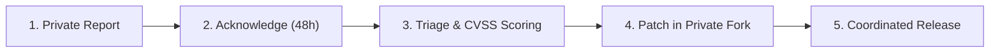

# Security Policy

The **SpringCore** project takes the security of our software and users seriously. This document outlines our security commitment, supported versions, and procedure for reporting potential security vulnerabilities.

---

## Supported Versions

Only the latest major and minor release lines receive active security patches:

| Version | Supported          | Security Status |
| :---    | :---               | :--- |
| 2.x     | :white_check_mark: | Actively supported with security updates and dependency upgrades |
| 1.x     | :x:                | Deprecated. Please upgrade to 2.x |
| < 1.0   | :x:                | End of Life |

---

## Reporting a Vulnerability

If you believe you have discovered a security vulnerability in SpringCore, please do **NOT** open a public issue or discussion. Publicly disclosing a vulnerability could put systems using this code at risk.

Instead, please report the vulnerability privately:

1. **Email:** Send details to `security@springcore.dev` (or open a private security advisory on GitHub under the **Security** tab).
2. **Details to Include:**
   - A description of the vulnerability and its potential impact.
   - The version(s) of SpringCore affected.
   - Detailed steps to reproduce the issue (proof-of-concept script, curl commands, or sample request payload).
   - Any proposed mitigations or fixes.

---

## Response & Disclosure Process

- **Initial Response:** The maintenance team will acknowledge receipt of your report within **48 hours**.
- **Assessment:** We will evaluate the report, verify the vulnerability in an isolated test environment, and determine its severity based on CVSS scoring.
- **Remediation:** If verified, we will develop and test a patch within a private fork.
- **Public Disclosure:** Once a fix is released in a new patch version, we will coordinate public disclosure and credit the reporter in the release notes (unless anonymity is requested).

---

## Security Best Practices Built into SpringCore

- **Boundary Validation:** Jakarta Bean Validation on all incoming DTO records prevents injection and malformed input.
- **Error Obfuscation:** RFC 7807 problem details mask internal Java stack traces from clients while logging them securely with correlation IDs.
- **Distributed Tracing:** Every request is stamped with an `X-Correlation-ID` header, enabling fast forensic audit trails in distributed logs.
- **CORS Hardening:** Centralized CORS configuration whitelists known origins and restricts method exposure.
- **Regular Dependency Scans:** Dependencies are tracked and updated against known CVE databases (OWASP Dependency-Check / GitHub Dependabot).

